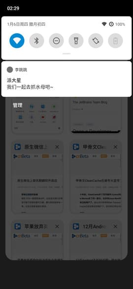

# IAmNotDisabled
使用xposed hook假装自己没有使用无障碍服务，  

## ！！！本项目并非反反作弊用途，只针对善意的无障碍检测，不保证对反作弊检测有效！！！

起因：[https://www.v2ex.com/t/826317](https://www.v2ex.com/t/826317)  
使用无障碍服务会被部分app特殊对待，  
然而有可能使用了无障碍只是为了便利，并不希望被优待，  
于是有了本项目，  
针对chrome，假装自己没有使用无障碍服务，才可以使用新版的各种标签相关功能和动画，  

### 项目包含两个应用模块
* app 我残？ 用于测试hook效果，打开时检测到无障碍服务就会提示，
* hook 非残！ xposed模块通过hook负责查询无障碍的系统服务伪装成没有启用无障碍服务，

### 模块使用需求
* 安卓8以上，不为啥，只是觉得没必要支持旧版，
* [Riru-LSPosed](https://github.com/LSPosed/LSPosed) 1.6.5以上，不为啥，只是因为我开发时在用的就是这个，
* 理论上对任何目标应用都有效，

### 模块使用方法
1. 手机解锁，
1. 刷入Magisk，
1. 刷入Magisk模块Riru和Riri-LSPosed，
1. 安装“[非残！](https://github.com/AoEiuV020/IAmNotDisabled/releases)”，IAmNotDisabled-hook.apk，
1. 在LSPosed中激活非残并勾选需要隐瞒无障碍服务应用，比如chrome，
1. 重启目标应用生效，

下图，开启“李跳跳”的同时使用chrome的新版标签，  

